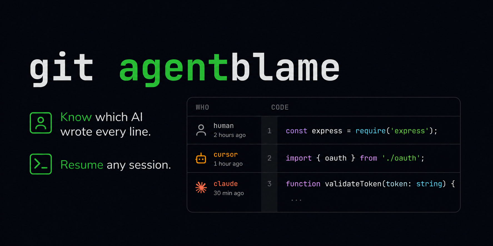

<!-- Seshmark Brand Header -->
<p align="center">
  
</p>

<h1 align="center">Seshmark</h1>

<p align="center">
  
</p>

---

```bash
curl -fsSL https://seshmark.github.io/seshmark/install.sh | bash
```

**Try it without installing:**
```bash
git clone https://github.com/seshmark/demo
cd demo
git agentblame src/api.ts
```

## What It Does

Seshmark auto-tags every AI commit with metadata — agent, model, session ID — embedded directly in Git commit messages. Later, you can query, blame, and resume sessions.

**Zero configuration.** Install once. Use any AI tool. The Git hook handles everything.

```bash
$ git agentblame src/auth.ts

  1  [human]           const express = require('express');
  2  [cursor]          import { oauth } from './oauth';
  3  [claude]          function validateToken(token: string) {
  4  [human]             if (!token) return null;
  5  [copilot]           const hash = crypto.sha256(token);
```

## Install

```bash
curl -fsSL https://seshmark.github.io/seshmark/install.sh | bash
```

Works on macOS, Linux, and WSL. One command. No dependencies.

## How It Works — ✨ The Magic

1. **Install once.** Seshmark adds a silent Git hook. That's it. No config files. No daemons. No accounts.

2. **Use your AI tools as you normally would.** Cursor, Claude Code, Copilot, Pi, Aider, OpenCode — any of them. Every commit gets invisibly stamped with `AI-Agent`, `AI-Session`, and `AI-Model` trailers. You won't even notice it happening.

3. **Run `git agentblame` whenever you're curious.** Suddenly every line has a story. Which AI wrote it? What session? What model? It's all there.

4. **Or dig deeper.** Query by agent, model, or file. Resume the exact session. Share stats with your team.

Seshmark figures out which AI tool is running automatically — whether through environment variables, branch names, or process detection. You don't need to think about it. It just works.

> *Curious how it actually works? See [`ADD_A_HARNESS.md`](ADD_A_HARNESS.md) for the technical details.*

## The Convention

AI-assisted commits include trailers:

```
feat: implement OAuth2 middleware

Seshmark-Version: 1.0.0
AI-Session: cursor:chat-abc123
AI-Agent: cursor
AI-Model: claude-sonnet-4-20250514
```

This convention works even without installing the seshmark CLI — just type the trailers manually.

## Commands

| Command | Description |
|---------|-------------|
| `git agentblame <file>` | Show AI attribution per line |
| `seshmark stats` | Shareable report: AI % by agent, model, file |
| `seshmark query [filters]` | Search AI-tagged commits |
| `seshmark who [commit]` | Show metadata for a commit |
| `seshmark context <commit>` | Reconstruct session context |
| `seshmark log <session>` | List commits in a session |
| `seshmark status` | Show active session |
| `seshmark doctor` | Diagnose installation |

## For Harness Builders

Add three env vars before `git commit`:

```python
env["SESHMARK_SESSION_ID"] = "opencode:sess-001"
env["SESHMARK_AGENT"] = "opencode"
env["SESHMARK_MODEL"] = "qwen2.5-coder"
```

That's it. No library import. No API call. No dependency. Works with Cursor, Claude Code, OpenCode, Copilot, Aider, and any tool that sets env vars before `git commit`.

Integrations for each tool: [`HARNESS_EXAMPLES.md`](HARNESS_EXAMPLES.md)

## Session Resumption

After finding which AI wrote a line, you can resume the exact session:

```bash
seshmark resume HEAD                  # Resume session from latest commit
seshmark resume a3f9d2e               # Resume from a specific commit
seshmark resume cursor:chat-abc123    # Resume by session ID
```

Seshmark tries to find a **resolver** (a script that knows how to open the native tool).

### Manage Resolvers

```bash
seshmark resolver list                # List installed resolvers
seshmark resolver create cursor       # Create a starter resolver
seshmark resolver install mytool ./my-resolver.sh
seshmark resolver test cursor         # Test with a dummy session
seshmark resolver uninstall mytool
```

### Add Your Own Resolver

Any tool can add seshmark support by creating one script:

```bash
# ~/.local/share/seshmark/resolvers/mytool
#!/bin/bash
SESSION_ID="$1"
mytool resume "$SESSION_ID"
```

Built-in resolvers for Pi, OpenCode, Cursor, and Claude Code are at [`examples/resolvers/`](examples/resolvers/).

## For Orchestrators (AI Agents)

Every command supports `--format json`. Any AI agent can run seshmark commands and consume the output:

```bash
seshmark blame src/auth.ts --format json
seshmark context HEAD --format prompt
seshmark stats --format json
```

## Agent Skill System

AI agents (Pi, Claude Code, OpenCode, etc.) can load a skill that lets them query and resume sessions automatically. See [`SKILL_SYSTEM.md`](SKILL_SYSTEM.md).

## License

MIT
# pi dogfooding note
