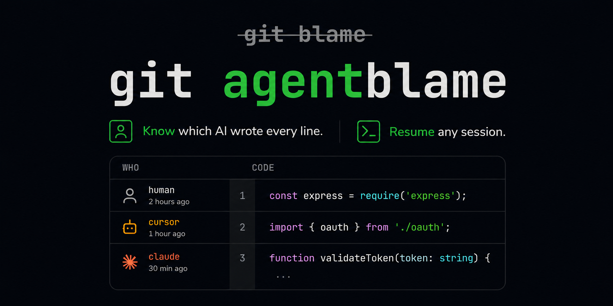

<!--
╔══════════════════════════════════════════════════════╗
║  Seshmark - git agentblame                          ║
║  Know which AI wrote every line.                    ║
╚══════════════════════════════════════════════════════╝
-->
<p align="center">
  
</p>

<h1 align="center">Seshmark</h1>

<h3 align="center">
  Know which AI (<code>cursor</code>, <code>claude</code>, <code>copilot</code>, <code>pi</code>) wrote every line.<br>
  <code>git agentblame</code> - like <code>git blame</code>, but for AI agents.
</h3>

<p align="center">
  <a href="https://github.com/seshmark/seshmark/releases">
    
  </a>
  <a href="LICENSE">
    
  </a>
  <a href="https://github.com/seshmark/seshmark/actions">
    
  </a>
</p>

<br>

<p align="center">
  
</p>

<br>

<p align="center">
  <b>One command to install. Works with every AI tool. Zero config.</b>
</p>

---

## Quick Start

```bash
curl -fsSL https://seshmark.github.io/seshmark/install.sh | bash
```

**Already installed? Upgrade to the latest:**

```bash
seshmark upgrade
```

**Try it without installing anything:**

```bash
git clone https://github.com/seshmark/demo
cd demo
git agentblame src/auth.ts
```

You'll see output like this - every line tagged with the AI agent that wrote it:

```
[human]          const express = require('express');
[cursor│abc123]  import { oauth } from './oauth';
[claude│xyz789]  function validateToken(token: string) {
[human]            if (!token) return null;
```

---

## What It Does

Seshmark is a **zero-infrastructure, tool-agnostic convention** that links AI coding agent sessions to Git commits.

When you (or your AI agent) make a commit, seshmark silently adds metadata - which agent, which model, which session - as standard Git trailers:

```
Seshmark-Version: 1.0.0
AI-Session: cursor:chat-abc123
AI-Agent: cursor
AI-Model: claude-sonnet-4-20250514
```

Later, you can **blame**, **query**, and **resume** any AI session. No config files. No databases. No APIs. Your data stays on your machine.

---

## How It Works - The Magic

1. **Install once.** Seshmark adds a silent Git hook. That's it.

2. **Use your AI tools as you normally would.** Cursor, Claude Code, Copilot, Pi, Aider, OpenCode - any of them. Every commit gets invisibly stamped with AI metadata. You won't even notice it happening.

3. **Run `git agentblame` whenever you're curious.** Suddenly every line has a story. Which AI wrote it? What session? What model?

4. **Dig deeper - query, resume, share stats.** It's all there.

Seshmark figures out which AI tool is running automatically - whether through a session you started (`seshmark track`), environment variables the tool sets, your branch name (`pi/feature`), or by detecting the tool's process directly. You don't need to think about it. It just works.

> *For the curious - [`ADD_A_HARNESS.md`](ADD_A_HARNESS.md) pulls back the curtain on how detection works and how to add support for any tool.*

---

## Commands

| Command | Description |
|---------|-------------|
| `git agentblame <file>` | Show which AI wrote each line. Customize with `--fields agent,model,session` |
| `seshmark query --agent cursor` | Search commits by agent, model, file, or date |
| `seshmark who <commit>` | Show full metadata (session, agent, model) for a commit |
| `seshmark stats` | AI usage report with agent breakdown and bar charts |
| `seshmark resume <session>` | Reopen the AI session that wrote the code |
| `seshmark track <session>` | Start tracking a session manually |
| `seshmark upgrade` | Check for updates and upgrade to the latest version |
| `seshmark doctor` | Diagnose your installation |

Every command supports `--format json` for programmatic use by AI agents and CI pipelines.

---

## Customize

**Blame output.** By default, `git agentblame` shows `[agent│session│model]`. Change it to show only what you need:

```bash
git agentblame file.ts --fields agent,model
```

Or create a `.seshmark.yml` file in your repo:

```yaml
# .seshmark.yml
blame:
  fields: [agent, session, model]
```

**Policy enforcement.** Add `.github/seshmark.yml` to require human review when AI code exceeds a threshold (Enterprise feature).

---

## Supported Tools

seshmark works with every AI coding harness - no special integration needed. Here's how they're detected:

| Tool | Detection Method | Metadata Captured |
|------|-----------------|-------------------|
| **Cursor** | Branch name (`cursor/feature`) or env vars | agent + session + model |
| **Claude Code** | Branch name (`claude/feature`) or env vars | agent + session + model |
| **Pi** | Process detection or env vars | agent |
| **Copilot** | Branch name (`copilot/feature`) or env vars | agent + session + model |
| **Aider** | Branch name (`aider/feature`) or process detection | agent |
| **OpenCode** | Branch name (`opencode/feature`) or env vars | agent + session + model |
| **Any CLI tool** | Process detection - walks parent processes automatically | agent |
| **Any tool with env vars** | SESHMARK_SESSION_ID + SESHMARK_AGENT | session + agent + model |

See [`ADD_A_HARNESS.md`](ADD_A_HARNESS.md) to add support for any tool in 3 ways.

---

## For AI Tool Builders

Adding seshmark support to your tool is **three environment variables**:

```python
# Before calling git commit:
os.environ["SESHMARK_SESSION_ID"] = "my-tool:sess-001"
os.environ["SESHMARK_AGENT"] = "my-tool"
os.environ["SESHMARK_MODEL"] = "gpt-4o"
```

No library import. No API call. No dependency. That's it.

Want session resumption? Add a resolver script:

```bash
# ~/.local/share/seshmark/resolvers/my-tool
#!/bin/bash
SESSION_ID="$1"
my-tool resume --session "$SESSION_ID"
```

---

## Session Resumption

Found a line written by an AI and want to continue that conversation?

```bash
seshmark resume HEAD                  # Resume from latest commit
seshmark resume a3f9d2e               # Resume from a specific commit
seshmark resume cursor:chat-abc123    # Resume by session ID
```

Seshmark finds the right resolver script and opens the session in the native tool. Built-in resolvers for Pi, OpenCode, Cursor, and Claude Code are in [`examples/resolvers/`](examples/resolvers/).

---

## GitHub Action — AI Reports on PRs

See the bigger picture. When you install the [Seshmark Agent Blame action](https://github.com/seshmark/agentblame) in your repo, every Pull Request gets an automated comment showing:

- What percentage of the PR was written by AI vs humans
- Which AI agents were used (Cursor, Claude, Copilot, Pi, etc.)
- Which models generated the code
- Which files have the most AI content

**Add to your repo** — one file, no config:

```yaml
# .github/workflows/seshmark.yml
on: pull_request
jobs:
  report:
    runs-on: ubuntu-latest
    permissions:
      pull-requests: write
      contents: read
    steps:
      - uses: actions/checkout@v4
        with: { fetch-depth: 0 }
      - uses: seshmark/agentblame@v1
```

The action reads the commit trailers your team's commits already have (from the CLI hook). No external services. No data leaves GitHub.

**[View full docs &rarr;](https://github.com/seshmark/agentblame)**

---

## Contributing

See [`CONTRIBUTING.md`](CONTRIBUTING.md) for:
- Development setup guide
- How to add a resolver for a new tool
- Running tests (`go test ./...`)
- Building from source
- Pull request guidelines

---

## License

MIT &copy; [Seshmark Contributors](https://github.com/seshmark/seshmark)

---

<p align="center">
  <sub>100% client-side · No servers · No APIs · No telemetry · Your data stays on your machine</sub>
</p>
